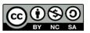

# ObserveAssign
Remote observation through video assignments. This project allows users to upload videos and assign them to users, with a set number of views and replays allowed.

## Configuration
- Search the solution for DOMAIN - and replace with your URL.
- In EmailUtilities - replace the SMTP_HOST with your SMTP server configuration.
- The site uses Telerik controls, so a Telerik license will need to be obtained, or an alternative solution selected.
- To modify the default upload file size (currently set to 500 MB) - modify the MAXVIDEOLENGTH in the Videos/Create.cshtml.cs file.

### Branding
In the Shared/_Layout.cshtml file, you can add your own header and footer logos and text, there are placeholders for the BRAND_LOGO images in the header and footer.

### Database
The ObserveAssign site depends on a database backend to store the information provided. Update the appsettings.json file to include your database connection strings.

The site was setup using migrations - to run the initial database setup migration and create the basic tables needed for the application, use the following steps:
1. Create a new database, and set your username and password for the database.
1. Add your database connection string to the appsettings.json file
1. In Visual Studio, Open the Package Manager Console
1. Run: "dotnet ef database update --context ApplicationDbContext"

### Storage
ObserveAssign was initially designed using AWS S3 and AWS Cloudfront. Update the appsettings.json file with the details for your configuration.
- [AWS Configuration Instructions](.github/AWS_CONFIGURATION_INSTRUCTIONS.md)

### Using the tool
1.	Initial Admin Account Update: 
    - Begin by updating the initial admin account by clicking on the email address in the top right corner, then clicking password.
2.	Project Creation: 
    - Navigate to the main navigation menu and select the "Projects" menu.
    - Create a new project.
3.	School Creation: 
    -	 After creating the project, go to the "School" menu in the main navigation.
    -	Create the school.
4.	Admin and Viewer Account Management: 
    -	Under the "Administration" option in the main navigation, you can create additional admin accounts or video viewer accounts.
5.	Video Upload: 
    -	Once the accounts are set up, the admin can upload videos. Note that the default maximum video size is 500 MB.
    -	The "Number of Views Allowed" field determines how many times a video viewer can access the video before needing to request additional views.
6.	Assigning Videos to Viewers: 
    -	After uploading the videos, the admin can assign videos to viewers.
    -	If SMTP has been configured, the video viewer will receive an email notification informing them that they have been assigned a video.
7.	Granting Additional Views: 
    -	Admins can use the "Actions" tab to grant users the ability to watch videos again if needed.

## Contributions

Contributions from external collaborators will be considered for inclusion in the solution. Please see [Contributing to ObserveAssign](.github/CONTRIBUTING.md), and the [Code of Conduct](CODE_OF_CONDUCT.md) for details.

## License

The contents of this git repository, consisting of Observe Assign Code (hereinafter “material”) were developed under a grant from the Department of Education. However, these contents do not necessarily represent the policy of the Department of Education, and you should not assume endorsement by the Federal Government. The material provided herein is available for use subject to the following Creative Commons license: [CC BY-NC-SA](LICENSE.md). As such, the user may access, reproduce, publicly perform, display, distribute, and prepare derivative works of the material, provided: (1) in all such instances, attribution is given the copyright holder in the following manner: Observe Assign Code, American Institutes for Research, https://github.com/American-Institutes-for-Research/observeassign, [CC BY-NC-SA](LICENSE.md); (2) neither the material, nor any derivative works may be used for commercial purposes; (3) derivative works must be used, credited, and licensed under terms identical to those contained herein.

Please note that this material is hereby provided “as-is” and that use of such material is at the user’s sole risk and discretion. American Institutes for Research (AIR) hereby disclaims any liability whatsoever, and however caused, even if same could not be reasonably anticipated, relating to the use of such material.
